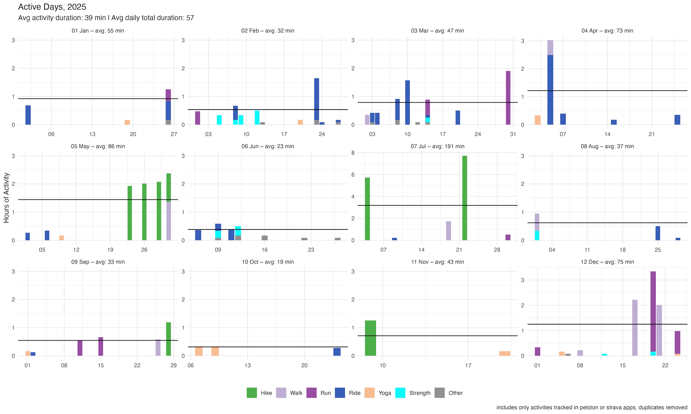
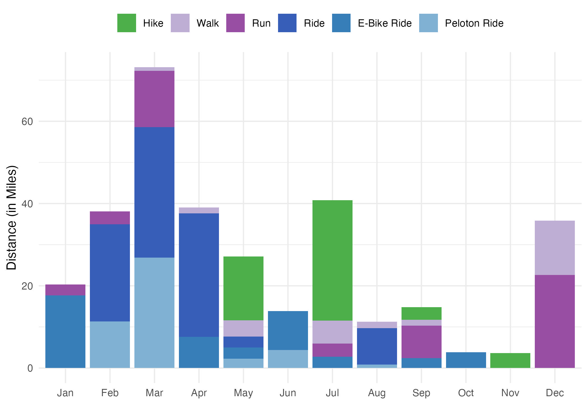

# actvyr

<!-- badges: start -->
<!-- badges: end -->

The goal of actvyr is to build year in review data and plots from strava and peloton data. 

## Installation

You can install the development version of actvyr like so:

Install the current version from GitHub with:

```r
# install.packages("pak")
pak::pak("monkeywithacupcake/actvyr")
```

## Example

This is a basic example which shows you how to solve a common problem:

``` r
library(actvyr)
## basic example code
```

## Get Your Data

This is designed for strava (and optionally peloton data). You will first need to request your data from Strava (and or peloton). Strava will point you to a website where you will download a folder with all of your account data. For the purpose of this package, you are only interested in the `activities.csv`. Peloton will allow you to download a file that is `[username]-workouts.csv`. 

This package is only useful after you have those data. 

## Usage

First, you will want to get clean data for your year. Example data are included to get you started. The example data are from 2025. 

### read in your data

You might do something like this. 

```r
this_year <- 2025
this_dir <- "your_downloads"
pfile <- "ex_peloton.csv" # [username]-workouts.csv
sfile <- "activities.csv"

# you may not have this one, peloton_df is optional
peloton_df <- clean_peloton_file(fpath = file.path(this_dir, pfile),
                                 this_year = this_year)

strava_df <- clean_strava_file(fpath = file.path(this_dir, sfile), 
                               this_year= this_year,
                               this_tz = "America/Los_Angeles")

# actv_df is the basis of the rest of the functions
actv_df <- clean_activity_df(strava_df = strava_df, 
                             peloton_df = peloton_df)
```

There is some sample data stored with the package, `ex_peloton_df`, `ex_strava_df`, and `ex_actv_df`, so you can play with them or use them to develop the package further.

```r
# we have example data already compiled
actv_df <- ex_actv_df
```

### make some plots

#### daily 

```{r}
make_daily_activities_by_month_plot(actv_df, this_year)
```



This is best saved as a wide image. An example of how you might do that is shown, using ggsave.

```r
ggsave(filename = paste0("active_days",this_year,".jpg"),
       device = "jpeg",
       width = 15,
       height = 9,
       path = "~/Desktop")
```

#### monthly summary

There are a couple of monthly plots already created for you. 

First, you will want a monthly summarized version of the data. Here, we are using our example data again, which is a subset of data from a single user and is probably not as cool and impressive as an actual full year of your data.

```r
mo_df <- clean_monthly_type_summary(df = actv_df)
```

Then, you can make monthly plots.

```r
make_mo_dist_type_plot(df = mo_df)
```



```r
make_mo_elev_type_plot(df = mo_df)
```


